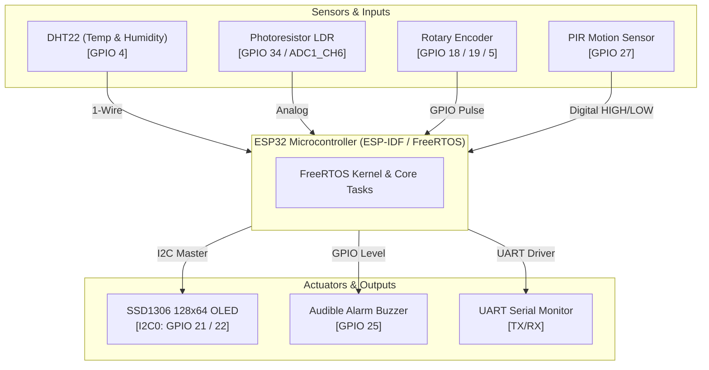
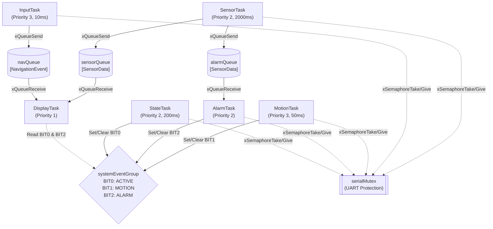
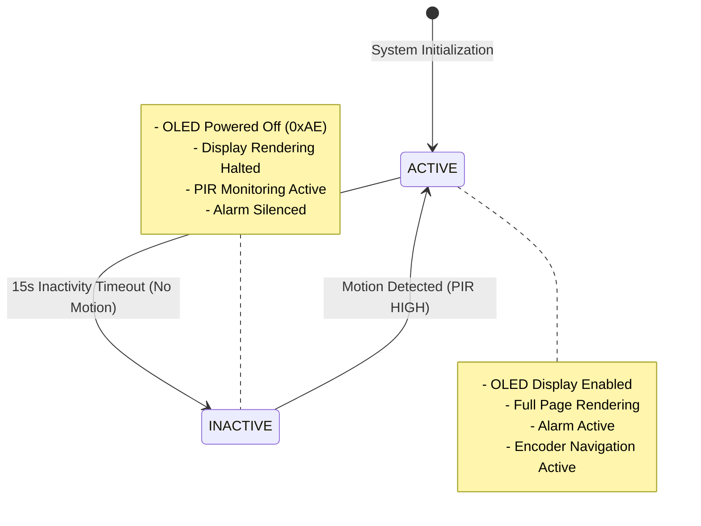

# Real-Time Multisensor Room Monitoring System (FreeRTOS & ESP-IDF)

[](https://platformio.org/)
[](LICENSE)
[](https://www.freertos.org/)

A robust, real-time embedded room-monitoring system designed for the ESP32 microcontroller using native **Espressif IoT Development Framework (ESP-IDF v5.2.1)** and **FreeRTOS** primitives. Built as part of Mindanao State University - Iligan Institute of Technology (MSU-IIT) BCA152 Microcontrollers Laboratory Activity No. 1.

---

## Project Overview

The **Real-Time Multisensor Room Monitoring System** acquires environmental data (temperature, humidity, ambient light, motion) from multiple sensors in real time and presents interactive feedback via an SSD1306 OLED display, audible alarm buzzer, and serial diagnostic streams. The system features a centralized **ACTIVE / INACTIVE** power management state machine that automatically powers down the display after 15 seconds of inactivity and instantly reactivates upon motion detection.

All application logic is implemented without Arduino abstractions, relying strictly on native ESP-IDF drivers (`driver/gpio.h`, `driver/i2c.h`, `driver/adc.h`) and core FreeRTOS primitives (`xQueue`, `xSemaphore`, `xEventGroup`, `vTaskDelayUntil`).

---

## Features

- **Concurrent Multi-Tasking Architecture:** 6 dedicated FreeRTOS tasks operating under deterministic priority scheduling.
- **Precise Periodic Sensor Sampling:** `SensorTask` utilizes `vTaskDelayUntil()` to eliminate timing drift while sampling DHT22 and LDR.
- **Interactive Rotary Encoder Navigation:** `InputTask` processes quadrature pulses to cycle display pages (`TEMPERATURE` -> `HUMIDITY` -> `LIGHT` -> `MOTION` -> `TEMPERATURE`).
- **OLED Display Subsystem:** Native ESP-IDF I2C driver driving a 128x64 SSD1306 display owned exclusively by `DisplayTask`.
- **Safety-Critical Temperature Alarm:** `AlarmTask` continuously evaluates temperature against safety limits ($18.0\,^\circ\text{C}$ to $30.0\,^\circ\text{C}$) and controls a hardware buzzer.
- **Power-Saving State Machine:** `StateTask` manages a 15-second inactivity timeout, switching between `ACTIVE` (full rendering) and `INACTIVE` (OLED powered down, reduced I2C bus traffic).
- **Thread-Safe IPC & Synchronization:** Shared UART output protected by binary mutex (`serialMutex`), multi-task event signaling managed by FreeRTOS Event Group (`systemEventGroup`).
- **Automated Unit Testing & Static Analysis:** 13 hardware-independent unit tests using Unity and zero-warning static analysis.

---

## Learning Objectives

1. Design concurrent firmware using native ESP-IDF and C/C++ without Arduino abstractions.
2. Structure FreeRTOS applications across independent modular source files.
3. Apply deterministic FreeRTOS task priority scheduling and justify urgency bounds.
4. Implement inter-task communication using FreeRTOS queues and event group bit signaling.
5. Protect shared hardware resources against race conditions using FreeRTOS mutexes.
6. Enforce drift-free periodic execution using `vTaskDelayUntil()`.
7. Implement state machines for embedded power-aware systems.
8. Separate hardware-independent decision logic for automated unit testing.

---

## System Architecture

The hardware topology interfaces the ESP32 with environmental sensors and user peripherals:



---

## FreeRTOS Architecture

Data flow and synchronization across the 6 tasks:



---

## Hardware / Simulated Components

| Component | Wokwi Model Type | ESP32 Connection | Functional Purpose |
| :--- | :--- | :--- | :--- |
| **ESP32** | `board-esp32-devkit-c-v4` | Main Microcontroller | Executes ESP-IDF firmware & FreeRTOS tasks |
| **DHT22** | `wokwi-dht22` | GPIO 4 | Measures ambient temperature ($^\circ\text{C}$) and relative humidity ($\%$) |
| **Photoresistor** | `wokwi-photoresistor-sensor` | GPIO 34 (ADC1_CH6) | Measures ambient light intensity ($0\text{--}100\%$) |
| **Rotary Encoder** | `wokwi-ky-040` | CLK: GPIO 18, DT: GPIO 19, SW: GPIO 5 | User page navigation input |
| **PIR Sensor** | `wokwi-pir-motion-sensor` | GPIO 27 | Motion detection for system activation |
| **SSD1306 OLED** | `wokwi-ssd1306` | SDA: GPIO 21, SCL: GPIO 22 | Displays active measurement page & alarm banner |
| **Buzzer** | `wokwi-buzzer` | GPIO 25 | Emits audible warning on temperature alarm |

---

## Pin Configuration

| GPIO Pin | Function / Peripheral | Direction | Configuration Notes |
| :--- | :--- | :--- | :--- |
| **GPIO 4** | DHT22 Data | Open-Drain / In-Out | Microsecond pulse protocol with pull-up |
| **GPIO 18** | Encoder CLK | Input | Internal Pull-Up enabled |
| **GPIO 19** | Encoder DT | Input | Internal Pull-Up enabled |
| **GPIO 5** | Encoder Pushbutton (SW) | Input | Internal Pull-Up enabled |
| **GPIO 21** | I2C0 SDA (OLED) | Open-Drain Output | $400\,\text{kHz}$ I2C Master speed |
| **GPIO 22** | I2C0 SCL (OLED) | Open-Drain Output | $400\,\text{kHz}$ I2C Master speed |
| **GPIO 25** | Alarm Buzzer | Output | High = Sound ON, Low = Sound OFF |
| **GPIO 27** | PIR Motion Output | Input | Internal Pull-Down enabled |
| **GPIO 34** | LDR Analog Input | Analog Input | ADC1 Channel 6, 12-bit width ($0\text{--}4095$) |

---

## Task Design

| Task Name | Priority | Trigger / Period | Primary Responsibility | Blocked Condition |
| :--- | :---: | :--- | :--- | :--- |
| **MotionTask** | 3 | Periodic (50 ms) | Polls PIR pin; sets/clears `EVENT_MOTION` bit | `vTaskDelay` |
| **InputTask** | 3 | Periodic (10 ms) | Decodes quadrature encoder pulses; pushes to `navQueue` | `vTaskDelay` |
| **SensorTask** | 2 | Periodic (2000 ms) | Samples DHT22 & LDR; pushes readings to queues | `vTaskDelayUntil` |
| **AlarmTask** | 2 | Sensor Event | Evaluates temperature against bounds; toggles buzzer | `xQueueReceive(alarmQueue)` |
| **StateTask** | 2 | Periodic (200 ms) | Evaluates 15s inactivity timeout; manages `SystemState` | `vTaskDelay` |
| **DisplayTask** | 1 | Queue Event / 100ms | Renders active page on SSD1306 OLED | `xQueueReceive` timeout |

---

## Inter-Task Communication

1. **`sensorQueue` (`QueueHandle_t`):** Holds up to 5 `SensorData` structs for `DisplayTask`.
2. **`alarmQueue` (`QueueHandle_t`):** Holds up to 5 `SensorData` structs for `AlarmTask`.
3. **`navQueue` (`QueueHandle_t`):** Holds up to 10 `NavigationEvent` items (`NEXT`, `PREVIOUS`) sent from `InputTask` to `DisplayTask`.
4. **`systemEventGroup` (`EventGroupHandle_t`):** Bitmask for real-time system events:
   - `EVENT_ACTIVE (BIT0)`: High when system is ACTIVE; cleared on 15s inactivity timeout.
   - `EVENT_MOTION (BIT1)`: High during active PIR motion detection.
   - `EVENT_ALARM (BIT2)`: High when temperature violates bounds ($< 18.0\,^\circ\text{C}$ or $> 30.0\,^\circ\text{C}$).
5. **`serialMutex` (`SemaphoreHandle_t`):** Binary mutex ensuring exclusive access to UART serial printing.

---

## State Machine



---

## Repository Structure

```
bca152-freertos-multisensor-acompanado/
├── CMakeLists.txt
├── platformio.ini
├── diagram.json
├── wokwi.toml
├── README.md
├── Laboratory Activity 1.pdf
├── include/
│   ├── sensors.h
│   ├── display.h
│   ├── input.h
│   ├── alarm.h
│   ├── motion.h
│   ├── system_state.h
│   └── rtos_objects.h
├── src/
│   ├── main.cpp
│   ├── sensors.cpp
│   ├── display.cpp
│   ├── input.cpp
│   ├── alarm.cpp
│   ├── motion.cpp
│   ├── system_state.cpp
│   └── rtos_objects.cpp
├── test/
│   ├── test_alarm/
│   │   └── test_alarm.cpp
│   ├── test_navigation/
│   │   └── test_navigation.cpp
│   └── test_state_machine/
│       └── test_state_machine.cpp
└── docs/
    ├── laboratory-report.md
    └── wokwi_verification.md
```

---

## Getting Started

### Prerequisites

- [PlatformIO Core CLI](https://docs.platformio.org/en/latest/core/index.html) or PlatformIO IDE extension for VS Code.
- [Wokwi Simulator Extension](https://wokwi.com/) for Visual Studio Code (optional for simulation).

---

## Building the Project

Compile the firmware using PlatformIO CLI:

```powershell
pio run
```

Expected Output:
```
BUILD SUCCESSFUL
RAM:   3.6% (used 11840 bytes from 327680 bytes)
Flash: 21.6% (used 226193 bytes from 1048576 bytes)
```

---

## Running the Wokwi Simulation

1. Open the project folder in VS Code with the Wokwi extension installed.
2. Open `diagram.json`.
3. Click **Start Simulation** (or press `F5`).
4. Interact with DHT22 slider, LDR slider, PIR motion switch, and Rotary Encoder dial.

---

## Unit Testing

Run the automated test suites covering pure hardware-independent decision logic:

```powershell
pio test
```

### Verified Test Cases (13 Total)

- **Alarm Logic Tests (`test/test_alarm/test_alarm.cpp`):**
  1. `test_temperature_below_lower_threshold` ($< 18.0\,^\circ\text{C} \rightarrow \text{LOW\_TEMPERATURE}$)
  2. `test_temperature_exactly_lower_threshold` ($= 18.0\,^\circ\text{C} \rightarrow \text{NORMAL}$)
  3. `test_temperature_normal_value` ($25.4\,^\circ\text{C} \rightarrow \text{NORMAL}$)
  4. `test_temperature_exactly_upper_threshold` ($= 30.0\,^\circ\text{C} \rightarrow \text{NORMAL}$)
  5. `test_temperature_above_upper_threshold` ($> 30.0\,^\circ\text{C} \rightarrow \text{HIGH\_TEMPERATURE}$)
- **Navigation Tests (`test/test_navigation/test_navigation.cpp`):**
  1. `test_navigation_forward_transitions` (`TEMP` -> `HUM` -> `LIGHT` -> `MOTION`)
  2. `test_navigation_forward_wraparound` (`MOTION` -> `TEMP`)
  3. `test_navigation_reverse_transitions` (`MOTION` -> `LIGHT` -> `HUM` -> `TEMP`)
  4. `test_navigation_reverse_wraparound` (`TEMP` -> `MOTION`)
- **State Machine Tests (`test/test_state_machine/test_state_machine.cpp`):**
  1. `test_state_active_no_timeout` (`ACTIVE` $+ <15\text{s} \rightarrow \text{ACTIVE}$)
  2. `test_state_active_timeout` (`ACTIVE` $+ \ge 15\text{s} \rightarrow \text{INACTIVE}$)
  3. `test_state_inactive_no_motion` (`INACTIVE` $+$ no motion $\rightarrow \text{INACTIVE}$)
  4. `test_state_inactive_motion` (`INACTIVE` $+$ motion $\rightarrow \text{ACTIVE}$)

---

## Static Code Analysis

Run static code analysis using PlatformIO:

```powershell
pio check
```

All source code compiles cleanly under ESP-IDF 5.2.1 strict warning checks.

---

## Functional Verification

All 10 required functional test cases (FT-01 to FT-10) have been empirically verified in Wokwi. Detailed records are documented in [docs/wokwi_verification.md](docs/wokwi_verification.md).

---

## Engineering Decisions

1. **Native ESP-IDF I2C Driver for SSD1306:** Replaced heavy third-party graphics libraries with a lightweight 150-line ESP-IDF native I2C master driver and bitmap font renderer, eliminating external git dependencies.
2. **`vTaskDelayUntil()` for Periodic Sampling:** Ensures precise $2000\,\text{ms}$ sampling periods without cumulative timing drift caused by sensor reading execution delays.
3. **Queue Separation for Consumers:** Dedicated `sensorQueue` and `alarmQueue` allow `DisplayTask` (Priority 1) and `AlarmTask` (Priority 2) to consume data independently without message stealing.
4. **Mutex-Protected Serial Diagnostic Logs:** Guarantees non-interleaved, readable UART output across 6 concurrent tasks.

---

## Limitations

- Simulation environment relies on Wokwi's component models for DHT22 timing and LDR ADC behavior.
- Real-world ADC inputs would require non-linear calibration for precise lux conversion.

---

## Future Improvements

- Add Non-Volatile Storage (NVS) support to store user-configured alarm temperature thresholds.
- Integrate Wi-Fi / MQTT telemetry task for cloud-based remote room monitoring.

---

## References and Acknowledgments

- **Manual:** Mindanao State University - Iligan Institute of Technology, Dept. of Computer Applications, BCA152 Microcontrollers Activity No. 1, prepared by Asst. Prof. Paul Rodolf P. Castor, M.Sc.
- **Framework:** Espressif Systems ESP-IDF v5.2.1 & FreeRTOS kernel documentation.
- **Simulator:** Wokwi ESP32 Simulator.